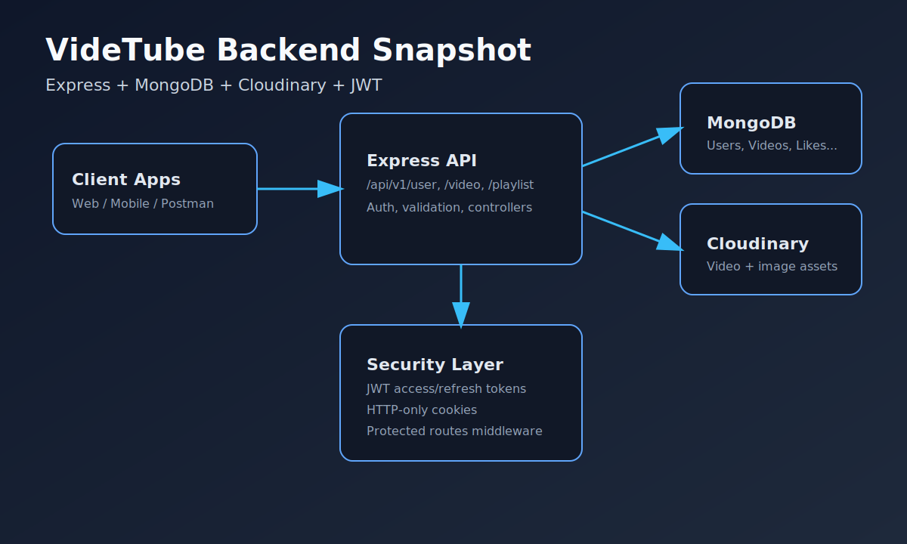

# VideTube Backend

A production-style Node.js + Express backend for a video-sharing platform (YouTube-like), with JWT auth, media upload, subscriptions, playlists, comments, tweets, likes, and channel dashboards.

## Screenshot



## Tech Stack

- **Runtime:** Node.js
- **Framework:** Express.js
- **Database:** MongoDB (Mongoose)
- **Auth:** JWT access + refresh token flow
- **Media storage:** Cloudinary
- **Uploads:** Multer
- **Utilities:** cookie-parser, cors, bcrypt

## Features

- User registration/login/logout with secure token handling
- Access token refresh workflow
- Profile update, avatar upload, cover image upload
- Video upload/update/delete + publish toggle + view count
- Comments on videos
- Likes for videos/comments/tweets
- Channel subscription/unsubscription
- Playlist create/update/delete and add/remove videos
- Tweet-style short updates per user
- Dashboard endpoints for channel analytics and videos
- Healthcheck endpoint for uptime monitoring

## Project Structure

```text
src/
  app.js
  index.js
  constants.js
  controllers/
  models/
  routes/
  middlewares/
  utils/
  db/
```

## Quick Start

### 1) Clone and install

```bash
git clone https://github.com/dipexplorer/VideTube.git
cd VideTube
npm install
```

### 2) Create environment file

```bash
cp .env.example .env
```

Update `.env` with your real values (especially MongoDB URI, JWT secrets, and Cloudinary credentials).

### 3) Ensure upload temp directory exists

Multer writes temporary files into `public/temp` before Cloudinary upload.

```bash
mkdir -p public/temp
```

### 4) Run the server

```bash
npm run dev
```

or

```bash
npm start
```

Default local URL: `http://localhost:3000`

## Environment Variables

Use `.env.example` as the source of truth.

| Variable | Required | Example | Description |
|---|---|---|---|
| `PORT` | No | `3000` | API server port |
| `NODE_ENV` | No | `development` | Runtime environment |
| `CORS_ORIGIN` | No | `http://localhost:5173` | Allowed frontend origin |
| `DB_URL` | Yes | `mongodb://127.0.0.1:27017` | MongoDB base URI (DB name appended internally) |
| `JWT_ACCESS_TOKEN_SECRET` | Yes | `long-random-secret` | JWT access signing secret |
| `JWT_ACCESS_TOKEN_EXPIRY` | Yes | `1d` | Access token TTL |
| `JWT_REFRESH_TOKEN_SECRET` | Yes | `long-random-secret` | JWT refresh signing secret |
| `JWT_REFRESH_TOKEN_EXPIRY` | Yes | `7d` | Refresh token TTL |
| `CLOUDINARY_CLOUD_NAME` | Yes (for uploads) | `mycloud` | Cloudinary cloud name |
| `CLOUDINARY_API_KEY` | Yes (for uploads) | `123456789` | Cloudinary key |
| `CLOUDINARY_API_SECRET` | Yes (for uploads) | `********` | Cloudinary secret |

## API Base Path

All endpoints are mounted under:

```text
/api/v1
```

## Main Routes

- `GET /healthcheck`
- `POST /user/register`
- `POST /user/login`
- `POST /user/logout`
- `POST /user/refresh-token`
- `GET /user/account`
- `GET /video/search`
- `POST /video/upload`
- `GET /video/:id`
- `POST /video/:videoId/comment`
- `POST /subscription/:channelId`
- `POST /playlist`
- `POST /like/video/:videoId`
- `POST /tweet`
- `GET /dashboard/:channelId/stats`

> Full route behavior depends on JWT-protected middleware and controller-level checks.

## Local Development Notes

- Use **Postman/Insomnia** to test multipart routes (`avatar`, `coverImage`, `thumbnail`, `videoFile`).
- Keep secrets out of git (`.env` is already ignored).
- Generate strong JWT secrets (`openssl rand -hex 32`).
- If CORS errors appear, verify `CORS_ORIGIN` and frontend URL/port match.

## Troubleshooting

- **MongoDB connection fails:** verify `DB_URL` and DB server availability.
- **Upload fails:** verify Cloudinary values and ensure `public/temp` exists.
- **Unauthorized (401):** check token cookie/header and refresh token flow.

## Scripts

```bash
npm run dev      # Run with nodemon
npm start        # Run with node
npm test         # Placeholder test script
```

## License

ISC
